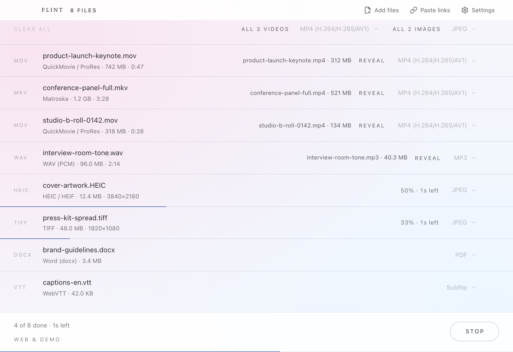

<p align="center">
  
</p>

# Flint

A local batch converter for video, audio, images, documents, subtitles and Flash.
Light pink-blue surfaces, subtle glass, and a built-in MIDI piano renderer.



## Use

1. Drop files or folders, or click **Add files**.
2. Choose an output format per file or category.
3. Click **Convert**, then **Open folder** to see the results.

Outputs normally go into a `Converted` subfolder. Existing names receive a numbered suffix;
originals are protected. Settings controls destination, quality, metadata and concurrency.
**Stop** cancels active work. Failed files can be retried after correcting the reported problem.

**Paste links** accepts individual videos or tracks from YouTube, Bilibili, QQ Music, NetEase,
SoundCloud and Bandcamp. It requires yt-dlp; YouTube also needs Deno or Node.js. Links use your
custom output folder, or Downloads. Playlists and protected/preview-only tracks are not supported.
Only convert material you have permission to use. See [Links](docs/LINKS.md).

The arrow beside **Convert** opens **Crop & convert** for pixel crops, media time ranges and
inclusive document page/word ranges. Unchecked categories stay queued. See [Crop](docs/CROP.md).

Settings also offers color/font skins with a reversible preview. See [Skins](docs/SKINS.md).

MIDI (`.mid`, `.midi`) renders offline with a built-in basic synthesized piano. All tracks and
channels use piano, including percussion channels; instrument changes are ignored. Tempo,
velocity, sustain, volume, pan and fixed ±2-semitone pitch bend are supported. Type 0/1 files
up to 16 MB, 200000 events, 30 minutes and 256 simultaneous voices are accepted. Output includes
a one-second release tail. MIDI output/audio-to-MIDI is not supported.

## Formats and platforms

[Format catalog](FORMATS.md): 108 formats, 194 input extensions and 91 output formats.
FFmpeg and ffprobe are bundled; some formats require optional helpers shown in Settings.

Targets: Intel macOS 11+, Apple Silicon macOS 12+, and Windows 10/11 x64 with WebView2.
**Read [release status](docs/RELEASE-STATUS.md) before distributing a build.** Minimum-OS testing,
minimum-OS validation, signing and FFmpeg corresponding-source requirements remain open.
[Compatibility details](docs/COMPATIBILITY.md).

## Build

Use Node.js 22 and Rust 1.88+ on a supported development host.

```sh
npm ci
./scripts/fetch-sidecars.sh
npm run build:app
```

macOS requires Xcode command-line tools. `Build.command` provides a guided build.
For Intel cross-builds, fetch with `TARGET_TRIPLE=x86_64-apple-darwin` and build with
`npm run tauri -- build --target x86_64-apple-darwin --bundles app`.
Windows: run `Build-Windows.ps1`; prerequisites are in [Windows](docs/WINDOWS.md).

Downloads resume from `~/Library/Caches/flint/sidecars`. Override `FFMPEG_URL`, `FFPROBE_URL`,
`SIDECAR_CACHE_DIR` or `SIDECAR_DOWNLOAD_TIMEOUT` as needed. `file:///` archives are accepted.
Run `./scripts/fetch-sidecars.sh --check` to check the installed tools.

For a browser preview, run `npm run dev` and open <http://127.0.0.1:1420/>.
The preview simulates conversion; the desktop app performs it.

[Development and checks](CONTRIBUTING.md) · [Release procedure](docs/RELEASING.md)

## Privacy and rights

File conversion is local. No telemetry or file uploads are built into it. Link processing and
helper installation use the network; optional browser sign-in is user-configured.

Copyright © 2026. All rights reserved. The application source is proprietary.
[Third-party notices](THIRD-PARTY-LICENSES.md) apply to dependencies and bundled tools.

The internal `app.crossconverter.desktop` identifier and `cross-converter.skin.v1` storage key
are retained only to preserve existing settings and skins. Packages, executable and logs use Flint.

## Automatic downloads

Every successful build from a push to `main` refreshes the public **1.0.0** release.
All required platform builds and checks must pass first. Downloads use
`App-1.0.0-OS-architecture.ext`, such as `App-1.0.0-macOS-universal.zip`
or `App-1.0.0-Windows-x64.exe`. See [release automation](.github/RELEASES.md)
for the exact packages, checksums, and retry behavior.
